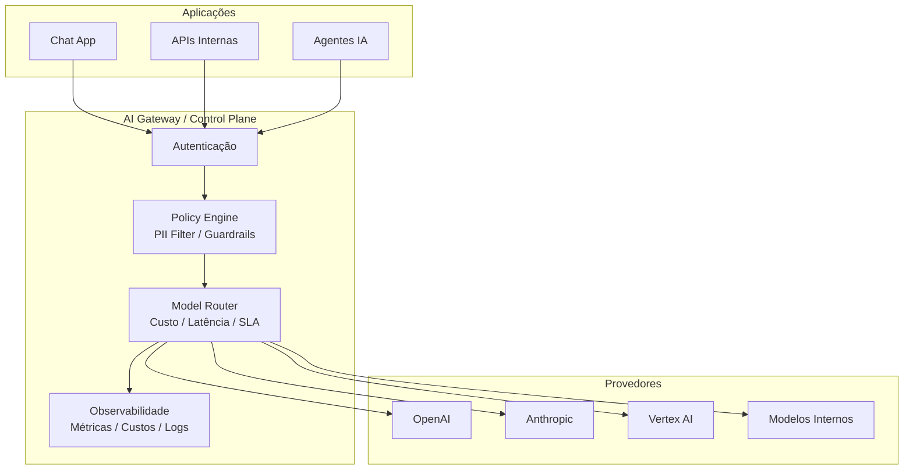

# AI Gateway - Implementações modernas em grandes empresas

## Contexto

Complemento ao estudo de [[ai-gateway]]. Foco em como grandes empresas estão implementando AI Gateways na prática e quais padrões arquiteturais emergiram além do conceito básico de proxy.

## Resumo

AI Gateway evoluiu de um simples proxy para um **AI Control Plane** — uma camada obrigatória de controle e orquestração entre aplicações e provedores de IA. Grandes empresas (Microsoft, AWS, Kong, Cloudflare) tratam o gateway como infraestrutura de plataforma, convergindo com API Gateways tradicionais e expandindo para orquestração de agentes.

## Pontos principais

### 🏗️ Padrão 1 — Centralized AI Gateway (Control Plane)

Padrão mais adotado atualmente (Microsoft, AWS, Kong).

- Gateway como **ponto único de entrada** com interface padronizada (OpenAI-like API)
- Multi-provider por baixo dos panos
- Autentica, valida, transforma payload e roteia para o melhor modelo
- Elimina o problema **N x M** de integrações, desacoplando aplicação do provider

> [!tip] Definição atualizada
> Um AI Gateway é um **middleware de controle e orquestração** entre aplicações e provedores de IA — não apenas um proxy.

### 🧩 Padrão 2 — Multi-LLM Routing (Model Router)

O gateway decide dinamicamente qual modelo usar baseado em custo, latência, tipo de tarefa e SLA:

- Tarefa de classificação simples → modelo barato
- Geração complexa → modelo premium
- Fallback automático se um provedor falhar

Permite **redução massiva de custo** sem sacrificar qualidade onde ela importa.

### 🔐 Padrão 3 — Policy Enforcement Layer (Security & Compliance)

O gateway funciona como um **Policy Engine** (também chamado de Prompt Firewall ou AI Guardrails Layer):

- Detecta e mascara PII antes de enviar para provedores externos
- Aplica regras de compliance (ex: "não enviar CPF", "não enviar dados financeiros")
- Bloqueia prompts perigosos ou fora do escopo

> [!warning] Crítico para contextos regulados
> Em sistemas financeiros, de saúde ou que lidam com dados sensíveis, essa camada é obrigatória — não opcional.

### 📊 Padrão 4 — Observability-Driven Gateway

Grandes empresas tratam IA como sistema crítico e usam o gateway para coletar:

- Tokens por requisição
- Custo por usuário/time
- Latência por modelo
- Taxa de erro
- Qualidade de respostas (via avaliação automática)

> AI Gateway deixou de ser proxy e virou **infraestrutura de observabilidade**.

### ⚙️ Padrão 5 — Convergência AI Gateway + API Gateway

Arquiteturas modernas não separam mais API Gateway e AI Gateway:

- Kong estendeu seu API Gateway para IA
- Microsoft integrou no Azure API Management

Resultado: mesmas políticas, segurança e governança para APIs tradicionais e de IA.

### ☁️ Padrão 6 — Cloud-Native (Kubernetes + Sidecar)

Empresas mais maduras deployam o AI Gateway como:

- Ingress especializado no Kubernetes
- Sidecar ou extensão de service mesh
- Escalável, resiliente e distribuído

### 🧠 Padrão 7 — AI Gateway como plataforma

Nível mais avançado — o gateway vira uma **AI Platform Layer** com:

- Catálogo de modelos e versionamento
- Governance UI e billing interno
- Auditoria completa

Arquitetura em 3 camadas: Frontend (apps) → AI Gateway (policies + routing) → Providers (externos + internos)

### 🧬 Padrão 8 — AI Gateway + Agents

Com Agentic AI, o gateway expande para **orquestração de agentes**:

- Controla chamadas entre agentes
- Define limites de execução
- Monitora comportamento

## 📦 Ferramentas do mercado

| Categoria              | Ferramentas                                             |
| ---------------------- | ------------------------------------------------------- |
| Enterprise-grade       | Kong AI Gateway, Microsoft AI Gateway, AWS (Bedrock)    |
| Modern / Dev-first     | Cloudflare AI Gateway, Vercel AI Gateway                |
| Open source / flexível | [[litellm\|LiteLLM]], APISIX, custom gateways           |

## Como aplicar

- AI Gateway resolve 4 problemas estruturais: **acoplamento ao provider**, **falta de governança**, **explosão de custos** e **risco de segurança (PII)**
- Para nosso contexto, priorizar os padrões 1 (centralizado), 2 (routing) e 3 (compliance/PII)
- Avaliar convergência com API Gateway existente (padrão 5) antes de criar componente separado
- Considerar [[litellm]] como implementação open source para PoC

## Diagramas / Visualizações

## Perguntas em aberto

- Qual o nível de maturidade necessário no time para adotar o padrão de plataforma (padrão 7)?
- Como medir o ROI de um AI Gateway centralizado vs. integrações diretas?
- Qual a estratégia de migração para serviços que já chamam LLMs diretamente?

## Fontes

- Pesquisa baseada em documentação pública de Microsoft, AWS, Kong, Cloudflare

## Notas relacionadas

- [[ai-gateway]] — estudo base sobre o pattern AI Gateway
- [[litellm]] — implementação open source de AI Gateway / LLM Proxy
- [[rate-limiting]] — uma das responsabilidades centrais do gateway
- [[referencia-aws-ai-gateway]] — documentação AWS sobre o pattern
