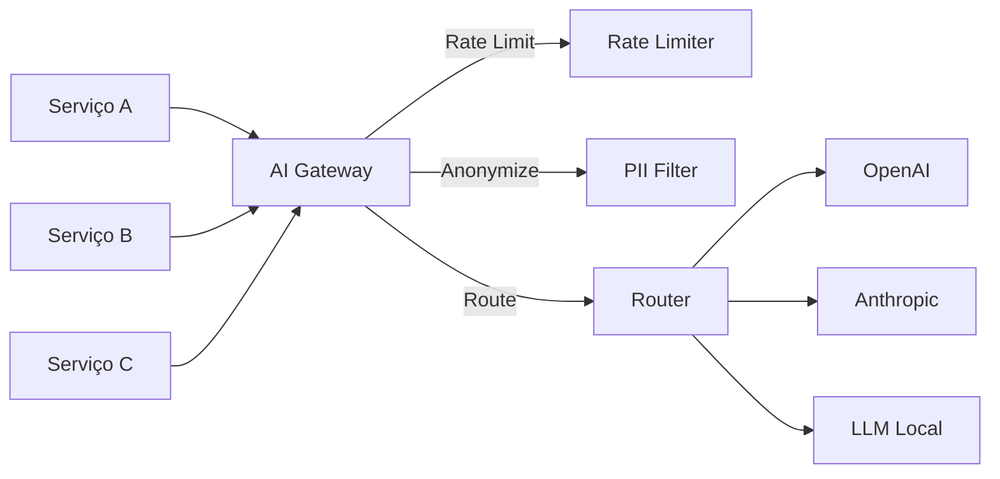
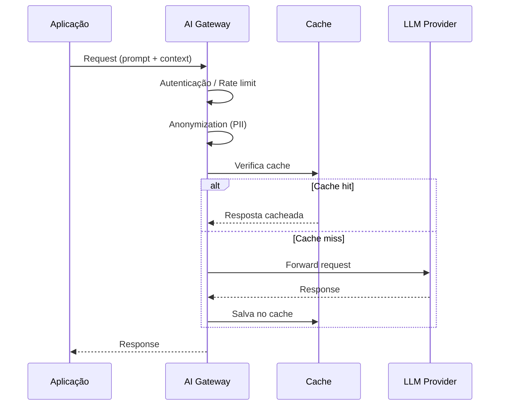

# AI Gateway

## Contexto

Com a adoção crescente de LLMs em serviços internos, surge a necessidade de um componente centralizado que intermedie a comunicação entre aplicações e provedores de modelos externos. Estudo focado em entender o pattern, responsabilidades e quando adotar.

## Resumo

AI Gateway é um componente arquitetural que atua como proxy/mediador entre serviços internos e APIs de modelos LLM externos (OpenAI, Anthropic, etc). Centraliza preocupações transversais como segurança, rate limiting, observabilidade e roteamento, evitando que cada serviço implemente essas responsabilidades individualmente.

## Pontos principais

- **Posicionamento**: fica entre a aplicação (consumer) e os provedores de LLM (providers)
- **Rate limiting**: controle de uso por serviço/time/usuário para evitar custos descontrolados
- **Routing**: direcionar requests para diferentes modelos/provedores baseado em custo, latência ou capacidade
- **Anonymization**: remover/mascarar PII antes de enviar dados para APIs externas
- **Security**: autenticação centralizada, controle de acesso, auditoria de uso
- **Observability**: logging, métricas de custo, latência e tokens consumidos
- **Caching**: respostas idênticas podem ser cacheadas para reduzir custo e latência
- **Fallback**: retry automático e failover entre provedores

## Como aplicar

- Avaliar se nossos serviços já consomem LLMs de forma descentralizada
- Propor como componente de plataforma se houver mais de 2 serviços consumindo LLMs
- Pode ser implementado como sidecar, API gateway dedicado ou biblioteca compartilhada
- Discutir com o time a abordagem mais adequada ao nosso contexto

## Diagramas / Visualizações

## Perguntas em aberto

- Qual o overhead de latência aceitável para o gateway?
- Como lidar com streaming responses (SSE) no gateway?
- Qual estratégia de cache faz sentido para respostas não-determinísticas?

## Fontes

- [[referencia-aws-ai-gateway]]
- [[referencia-portkey-ai-gateway]]

## Notas relacionadas

- [[strangler-fig-pattern]] — pode ser útil para migrar serviços existentes para usar o gateway gradualmente
- [[rate-limiting]] — termo no glossário
