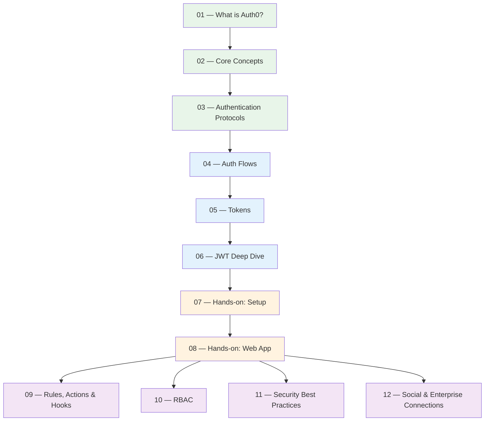

# 🔐 Auth0 Study Guide

A structured curriculum covering Auth0 from foundational IAM concepts to hands-on integration and advanced security patterns.

---

## 📚 Curriculum

### Part I — Foundations

| # | Lesson | Topics |
|---|--------|--------|
| 01 | [[auth0-lesson-01-what-is-auth0\|What is Auth0?]] | The problem it solves, IAM concepts, Auth0 vs. building auth yourself |
| 02 | [[auth0-lesson-02-core-concepts\|Core Concepts]] | Tenants, Applications, Connections, Users |
| 03 | [[auth0-lesson-03-authentication-protocols\|Authentication Protocols]] | OAuth 2.0, OpenID Connect (OIDC), SAML — theory |

### Part II — Tokens & Flows

| # | Lesson | Topics |
|---|--------|--------|
| 04 | [[auth0-lesson-04-auth-flows\|Auth Flows]] | Authorization Code, Client Credentials, Device, Implicit (legacy) |
| 05 | [[auth0-lesson-05-tokens\|Tokens]] | Access Token, ID Token, Refresh Token — structure & purpose |
| 06 | [[auth0-lesson-06-jwt-deep-dive\|JWT Deep Dive]] | Anatomy of a JWT, signing, verifying, claims |

### Part III — Hands-on

| # | Lesson | Topics |
|---|--------|--------|
| 07 | [[auth0-lesson-07-hands-on-setup\|Hands-on: Setup]] | Create a tenant, register an app, configure a Connection |
| 08 | [[auth0-lesson-08-web-app-integration\|Hands-on: Web App]] | Integrate Auth0 in a real app (Node.js, React, Next.js) |

### Part IV — Advanced Topics

| # | Lesson | Topics |
|---|--------|--------|
| 09 | [[auth0-lesson-09-rules-actions-hooks\|Rules, Actions & Hooks]] | Customizing the auth pipeline |
| 10 | [[auth0-lesson-10-roles-permissions-rbac\|Roles & Permissions (RBAC)]] | Authorization beyond authentication |
| 11 | [[auth0-lesson-11-security-best-practices\|Security Best Practices]] | Token storage, PKCE, rotation, common vulnerabilities |
| 12 | [[auth0-lesson-12-social-enterprise-connections\|Social & Enterprise Connections]] | Google, GitHub, Active Directory, SAML IdPs |

---

## 🗺️ Suggested Study Path

> [!tip] Study approach
> Lessons 1-8 are sequential — each builds on the previous. Lessons 9-12 are independent and can be studied in any order after completing lesson 8.

---

## 🔗 External Resources

- [Auth0 Documentation](https://auth0.com/docs)
- [Auth0 Blog](https://auth0.com/blog)
- [Auth0 Community](https://community.auth0.com/)
- [OAuth 2.0 Simplified](https://www.oauth.com/)
- [JWT.io — Debugger](https://jwt.io/)
- [OpenID Connect Spec](https://openid.net/developers/specs/)
