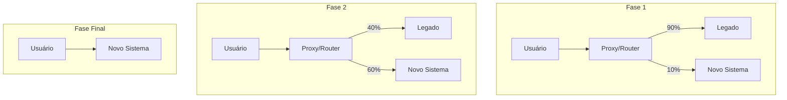

# Estratégias de Modernização de Sistemas

## Contexto

Modernizar sistemas legados é uma das decisões arquiteturais mais críticas e recorrentes. Entender as estratégias disponíveis, seus trade-offs e quando aplicar cada uma é essencial para o papel de arquiteto.

## Resumo

Existem múltiplas estratégias para modernizar sistemas legados, desde substituição completa (Big Bang) até migrações incrementais (Strangler Fig). A escolha depende de fatores como risco tolerado, tamanho do sistema, capacidade do time e pressão de negócio. Não existe bala de prata — a melhor estratégia é a que equilibra risco, custo e velocidade para o contexto específico.

## Pontos principais

### Big Bang Rewrite

- **O que é**: reescrever o sistema inteiro do zero e substituir de uma vez
- **Quando usar**: sistema muito pequeno, ou legado tão degradado que manter é mais caro que reescrever
- **Riscos**: altíssimo risco de falha, perda de regras de negócio implícitas, longo tempo sem entrega de valor
- **Estatística**: maioria dos big bang rewrites falham ou estouram prazo/orçamento

> [!danger] Anti-pattern comum
> Times subestimam a complexidade escondida no sistema legado. Regras de negócio que "ninguém sabe por que existem" geralmente estão lá por um bom motivo.

### Strangler Fig Pattern

- **O que é**: migrar funcionalidades incrementalmente, roteando tráfego do legado para o novo sistema aos poucos
- **Origem**: Martin Fowler, inspirado na figueira estranguladora que cresce ao redor de uma árvore
- **Quando usar**: sistemas grandes onde o risco de big bang é inaceitável
- **Como funciona**:
  1. Identificar uma funcionalidade para migrar
  2. Implementar no novo sistema
  3. Rotear tráfego para o novo componente
  4. Repetir até o legado ser desativado

> [!tip] Padrão recomendado
> Strangler Fig é a estratégia mais segura para a maioria dos cenários. Permite entregas incrementais e rollback granular.

### Branch by Abstraction

- **O que é**: introduzir uma camada de abstração no código existente, implementar a nova versão atrás dela, e trocar a implementação
- **Quando usar**: modernização interna (ex: trocar ORM, trocar lib de mensageria) sem mudar a interface externa
- **Vantagem**: não requer infraestrutura de roteamento, funciona no nível de código

### Parallel Run

- **O que é**: executar o sistema legado e o novo em paralelo, comparar resultados
- **Quando usar**: sistemas críticos onde corretude é essencial (financeiro, billing)
- **Custo**: alto custo operacional de manter dois sistemas rodando

### Anti-Corruption Layer (ACL)

- **O que é**: camada que traduz entre o modelo do legado e o modelo do novo sistema
- **Quando usar**: durante qualquer migração incremental, para isolar o novo sistema da "corrupção" do modelo legado
- **Relação**: complementar ao Strangler Fig e Branch by Abstraction

## Comparativo

| Estratégia            | Risco     | Velocidade | Custo     | Entrega incremental |
| --------------------- | --------- | ---------- | --------- | ------------------- |
| Big Bang              | Altíssimo | Lenta      | Alto      | Não                 |
| Strangler Fig         | Baixo     | Média      | Médio     | Sim                 |
| Branch by Abstraction | Baixo     | Média      | Baixo     | Sim                 |
| Parallel Run          | Baixo     | Lenta      | Altíssimo | Sim                 |

## Como aplicar

- Para o time: apresentar Strangler Fig como abordagem padrão para modernizações
- Sempre começar pelo mapeamento de funcionalidades e dependências do legado
- Definir métricas de sucesso antes de iniciar (latência, erros, corretude)
- Usar [[anti-corruption-layer]] para isolar domínios durante a transição
- Combinar estratégias: Strangler Fig + ACL + Branch by Abstraction

## Perguntas em aberto

- Como priorizar quais funcionalidades migrar primeiro?
- Qual o ponto de decisão entre manter o legado vs. migrar?
- Como medir o custo real de manter o legado (custo de oportunidade)?

## Fontes

- Martin Fowler — StranglerFigApplication (2004)
- Sam Newman — "Monolith to Microservices" (O'Reilly)
- [[referencia-martin-fowler-strangler]]

## Notas relacionadas

- [[ai-gateway]] — exemplo de componente que pode ser introduzido via Strangler Fig
- [[strangler-fig-pattern]] — termo no glossário
- [[anti-corruption-layer]] — termo no glossário
