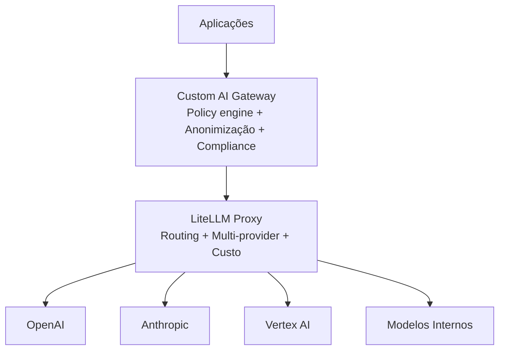

# LiteLLM é uma implementação de AI Gateway?

## Contexto

Ao estudar [[ai-gateway]] e [[litellm]] separadamente, surgiu a dúvida: o LiteLLM é de fato uma implementação de AI Gateway? Ou é apenas um SDK wrapper? Esse estudo analisa onde o LiteLLM se posiciona no espectro de soluções de gateway e quais lacunas ele deixa para contextos enterprise.

## Resumo

Sim — o LiteLLM Proxy Server é explicitamente um AI Gateway. A própria documentação o define como "LLM Gateway". Ele implementa cerca de 60–70% do que um AI Gateway enterprise oferece, cobrindo bem a camada técnica (routing, multi-provider, custo), mas deixando lacunas em governança corporativa, policy engine avançado e segurança enterprise-grade. Na prática, é mais usado como **foundation layer** sobre a qual se constrói um gateway customizado.

## Pontos principais

### ✅ Resposta direta

Sim — o LiteLLM Proxy Server é explicitamente um AI Gateway. A própria documentação confirma:

> "LiteLLM Proxy Server (LLM Gateway)"

> "central service (LLM Gateway) to access multiple LLMs"

> "proxy server (AI Gateway) to call 100+ LLM APIs"

### 🧠 O que o LiteLLM cobre como AI Gateway

#### 🔀 1. Abstração multi-provider (core do gateway)

- Interface única (OpenAI-compatible) para 100+ LLMs
- Tradução automática de APIs entre provedores
- Resolve o problema de **vendor lock-in**: trocar de OpenAI para Anthropic é só mudar o nome do modelo

#### 🔁 2. Routing + fallback

- Retry automático com backoff
- Failover entre modelos quando um provedor falha
- Load balancing entre deployments

Implementa exatamente o padrão de **Model Router** descrito em [[ai-gateway-implementacoes-modernas]].

#### 💰 3. Controle de custo e uso

- Tracking de gasto por usuário/projeto/time
- Budget limits — bloqueia requests ao atingir o teto
- Rate limiting por chave
- Suporte multi-tenant

Característica típica de gateway corporativo, essencial para evitar surpresas na fatura.

#### 🔐 4. Controle de acesso e governança básica

- API keys virtuais por usuário/time/projeto
- Auth hooks customizáveis
- Logging de todas as chamadas

Começa a tocar em **governança de IA**, mesmo que de forma básica.

#### 📊 5. Observabilidade

- Logs estruturados
- Métricas de uso e custo
- Callbacks para ferramentas externas: Langfuse, MLflow, Helicone, etc.

Base para AI observability — fundamental para operar LLMs em produção.

#### 🧱 6. Posicionamento arquitetural

O LiteLLM funciona exatamente como um gateway no diagrama arquitetural:

`App → LiteLLM Proxy → OpenAI / Anthropic / Vertex / etc.`

A documentação descreve explicitamente que ele é "designed to sit between applications and LLM APIs".

### ⚠️ Onde o LiteLLM NÃO é um AI Gateway completo

> [!warning] Limitações para contextos enterprise
> O LiteLLM implementa ~60–70% do que um AI Gateway enterprise faz. As lacunas abaixo são críticas para ambientes regulados ou de grande escala.

#### 🧠 1. Policy engine avançado (fraco ou inexistente)

Não possui:
- Detecção robusta de [[pii-personally-identifiable-information|PII]]
- Classificação semântica de dados sensíveis
- Enforcement complexo de políticas de conteúdo

Essas funcionalidades precisam ser implementadas em uma camada externa ao LiteLLM.

#### 🔐 2. Segurança avançada

- Não é um "prompt firewall" completo
- Não tem DLP (Data Loss Prevention) nativo enterprise-grade
- Proteção contra prompt injection é limitada

#### 🧬 3. Orquestração inteligente

- Routing baseado em regras simples (custo, latência)
- Não há decision engine baseado em contexto semântico
- Não há otimização dinâmica avançada de modelo por tipo de tarefa

#### 🏢 4. Governança corporativa completa

Não possui:
- Catálogo de modelos corporativo robusto
- Versionamento de prompts e modelos
- Compliance workflows completos
- Auditoria com rastreabilidade para regulatórios

#### ☁️ 5. Não é fully managed

Diferente de Microsoft AI Gateway ou AWS Bedrock Gateway, o LiteLLM exige que você:
- Hospede e mantenha a infraestrutura
- Gerencie escala e disponibilidade
- Monitore e opere o serviço

## 🧭 Classificação arquitetural

| Nível                         | Exemplos               | LiteLLM        |
| ----------------------------- | ---------------------- | -------------- |
| Level 1 — SDK wrapper         | LangChain              | Vai além       |
| Level 2 — Gateway básico      | LiteLLM                | Posição atual  |
| Level 3 — Gateway enterprise  | Kong AI Gateway, Azure | Parcial        |
| Level 4 — AI Platform         | AWS, Microsoft         | Não atinge     |

Resumindo: LiteLLM = **AI Gateway técnico (infra layer)**. Não é uma AI Platform completa.

## Como aplicar

### 🔹 LiteLLM como "foundation layer" do AI Gateway

A arquitetura mais comum no mercado usa o LiteLLM como base, com uma camada customizada acima para governança:

Essa separação de responsabilidades é deliberada:

- **LiteLLM** resolve o problema de **integração** (multi-provider, routing, custo)
- **Camada customizada** resolve o problema de **governança** (PII, compliance, políticas)

> [!tip] Recomendação prática
> Para começar, o LiteLLM sozinho já cobre as necessidades básicas. As camadas enterprise devem ser adicionadas conforme o uso de LLMs crescer e os requisitos de compliance exigirem — evita over-engineering no início.

## Perguntas em aberto

- Qual o esforço real para construir a camada de policy engine sobre o LiteLLM?
- Existe algum plugin ou middleware de PII detection que se integre nativamente?
- Comparar LiteLLM + camada custom vs. Kong AI Gateway como solução completa: custo, complexidade, funcionalidade
- Como o LiteLLM se comporta em alta disponibilidade? Quais são os pontos de falha?

## Fontes

- [[referencia-litellm-docs]]
- [[referencia-aws-ai-gateway]]

## Notas relacionadas

- [[ai-gateway]] — conceito base do pattern
- [[litellm]] — estudo detalhado da ferramenta
- [[ai-gateway-implementacoes-modernas]] — padrões de implementação em grandes empresas
- [[pii-personally-identifiable-information]] — limitação crítica do LiteLLM: ausência de policy engine robusto para PII
- [[rate-limiting]] — funcionalidade implementada pelo LiteLLM via virtual keys e budgets
