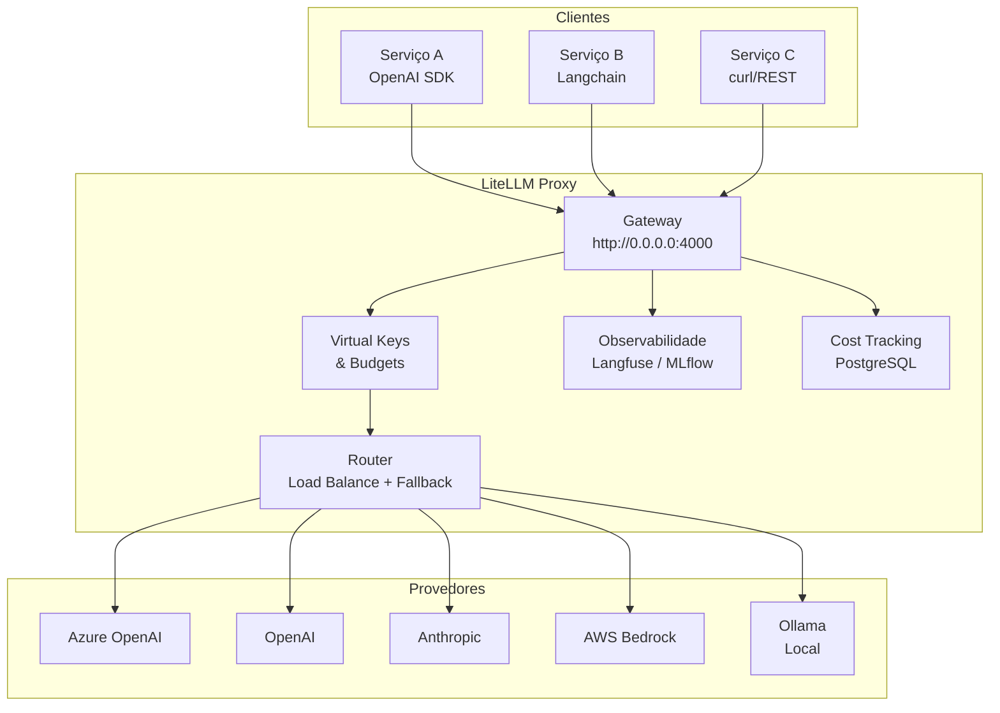

# LiteLLM

## Contexto

Ao estudar o pattern [[ai-gateway]], surgiu a necessidade de conhecer implementações concretas que ofereçam uma interface unificada para múltiplos provedores de LLM. O LiteLLM é uma das soluções open source mais adotadas nesse espaço, oferecendo tanto um SDK Python quanto um proxy server (gateway) auto-hospedado.

## Resumo

LiteLLM é uma biblioteca open source que fornece uma interface única e padronizada (formato OpenAI) para chamar mais de 100 LLMs de diferentes provedores — OpenAI, Anthropic, Vertex AI, Bedrock, Azure, Ollama, entre outros. Pode ser usado como SDK Python embutido na aplicação ou como um proxy server (LLM Gateway) auto-hospedado, com chaves virtuais, controle de custos, load balancing e painel administrativo.

## Pontos principais

### 1. Interface unificada no formato OpenAI

O problema central que o LiteLLM resolve é a fragmentação de APIs entre provedores de LLM. Cada provedor tem sua própria API, formato de request/response e tratamento de erros. O LiteLLM padroniza tudo no formato OpenAI:

```python
from litellm import completion

# Mesma interface para qualquer provedor
response = completion(
  model="anthropic/claude-3-opus-20240229",
  messages=[{"role": "user", "content": "Olá!"}]
)
# Resposta sempre no formato OpenAI ChatCompletion
```

> [!tip] Implicação arquitetural
> Ao adotar o LiteLLM, a aplicação fica desacoplada do provedor de LLM. Trocar de OpenAI para Anthropic ou de Azure para Bedrock exige apenas mudar o nome do modelo na configuração — sem alterar código.

### 2. Proxy Server como LLM Gateway

O LiteLLM pode ser deployado como um servidor proxy auto-hospedado que funciona como um [[ai-gateway]] completo. Qualquer cliente compatível com a API da OpenAI funciona com o proxy sem mudanças de código:

```yaml
# config.yaml
model_list:
  - model_name: gpt-4
    litellm_params:
      model: azure/gpt-4-deployment
      api_base: https://my-azure.openai.azure.com/
      api_key: sk-...
  - model_name: gpt-4
    litellm_params:
      model: openai/gpt-4o
      api_key: sk-...
```

```bash
litellm --config config.yaml
# Proxy rodando em http://0.0.0.0:4000
```

Funcionalidades do proxy:

- **Virtual keys**: chaves por usuário/time/projeto com controle de acesso
- **Budgets**: limites de gasto por chave, usuário ou time
- **Admin UI**: painel de monitoramento e gerenciamento
- **Compatibilidade**: funciona com OpenAI SDK, Anthropic SDK, Langchain, LlamaIndex, etc.

### 3. Load balancing, retry e fallback

O Router do LiteLLM distribui carga entre múltiplos deployments do mesmo modelo e gerencia resiliência automaticamente:

- **Load balancing**: distribui requests entre deployments (ex: múltiplas regiões Azure)
- **Fallback**: se um provedor falha, redireciona para outro automaticamente
- **Retry**: retry com backoff exponencial
- **Cooldown**: remove temporariamente deployments com falha
- **Rate limit awareness**: respeita limites de TPM/RPM por deployment

> [!important] Para produção
> Em ambientes de produção, o LiteLLM suporta Redis para rastrear cooldowns e gerenciar limites de TPM/RPM de forma distribuída.

### 4. Rastreamento de custos e spend tracking

O LiteLLM calcula automaticamente o custo de cada chamada com base em uma [tabela de preços por modelo](https://github.com/BerriAI/litellm/blob/main/model_prices_and_context_window.json) e registra o gasto no banco de dados (PostgreSQL):

- **Por chave**: quanto cada API key gastou
- **Por usuário**: quanto cada desenvolvedor gastou
- **Por time**: quanto cada equipe gastou
- **Budgets**: define limites máximos de gasto, bloqueando requests quando atingidos

Isso resolve diretamente o problema de controle de custos com LLMs — um dos maiores riscos de adoção descontrolada.

### 5. Observabilidade e integrações

Com uma única linha de configuração, o LiteLLM envia logs de input/output para ferramentas de observabilidade:

```python
import litellm
litellm.success_callback = ["langfuse", "mlflow", "helicone"]
```

Integrações suportadas incluem: Langfuse, MLflow, Helicone, Lunary, entre outras. Isso permite monitorar qualidade das respostas, latência, custos e uso em dashboards centralizados.

## Como aplicar

- **Avaliação como AI Gateway**: o LiteLLM Proxy é um candidato forte para implementar o pattern [[ai-gateway]] no nosso contexto, especialmente pela compatibilidade com o formato OpenAI
- **PoC rápido**: pode ser iniciado com `pip install 'litellm[proxy]'` e um `config.yaml` — baixa barreira de entrada para validação
- **Controle de custos**: se o time está experimentando com LLMs, o spend tracking por chave/time é essencial para evitar surpresas na fatura
- **Desacoplamento de provedor**: mesmo sem o proxy, o SDK já isola a aplicação de mudanças de provedor — útil para projetos que usam LLM diretamente
- **Discutir com o time**: avaliar se faz sentido adotar o proxy centralmente ou usar o SDK embutido nos serviços

## Diagramas / Visualizações



## Perguntas em aberto

- Qual o overhead de latência do proxy em relação a chamadas diretas?
- Como o LiteLLM lida com streaming (SSE) em cenários de fallback entre provedores?
- Qual a estratégia de migração para times que já usam o SDK da OpenAI diretamente?
- Como integrar com nosso sistema de autenticação existente (SSO/OIDC)?
- Comparar LiteLLM Proxy vs [[referencia-portkey-ai-gateway|Portkey Gateway]]: funcionalidades, performance, maturidade

## Fontes

- [[referencia-litellm-docs]]

## Notas relacionadas

- [[ai-gateway]] — LiteLLM é uma implementação concreta do pattern AI Gateway
- [[rate-limiting]] — o proxy implementa rate limiting por chave/time/usuário
- [[referencia-portkey-ai-gateway]] — alternativa open source a ser comparada
